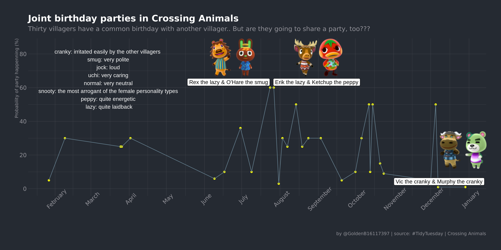
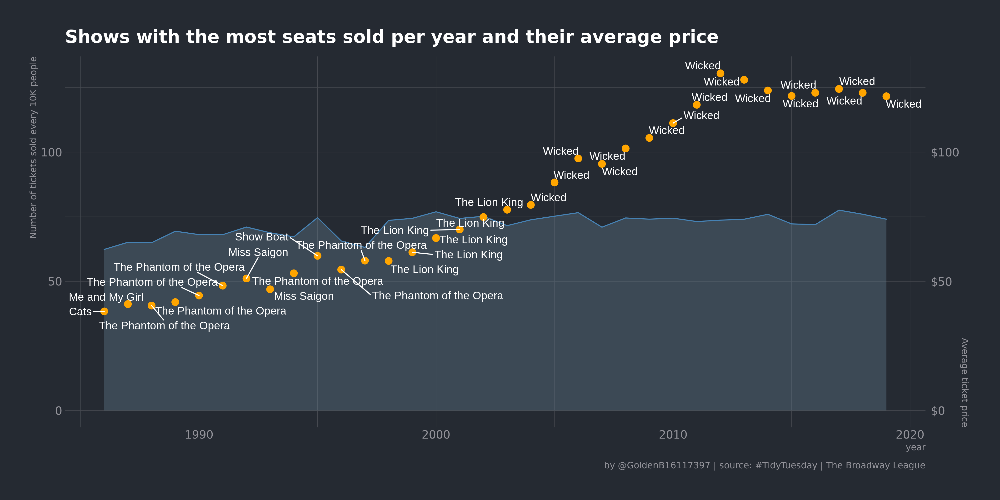
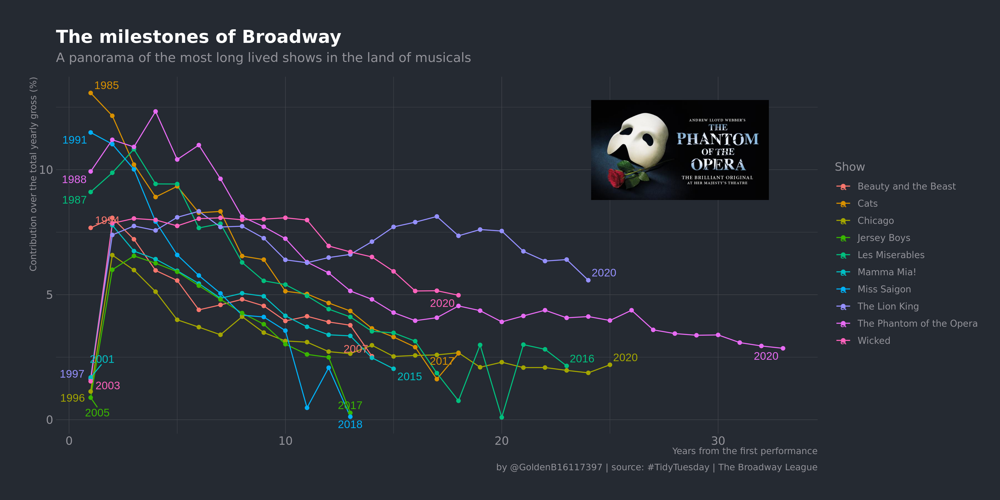
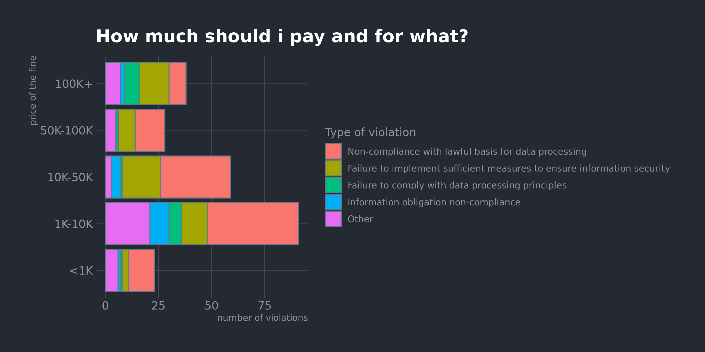
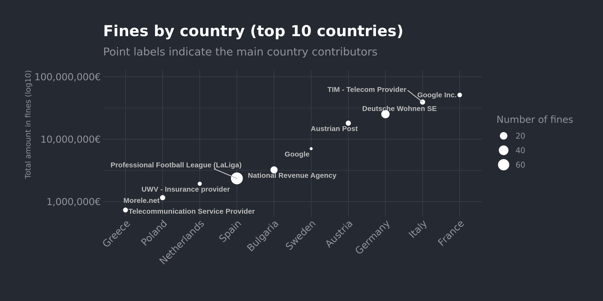
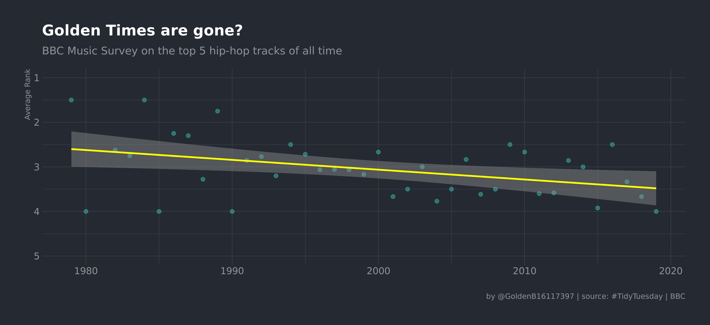
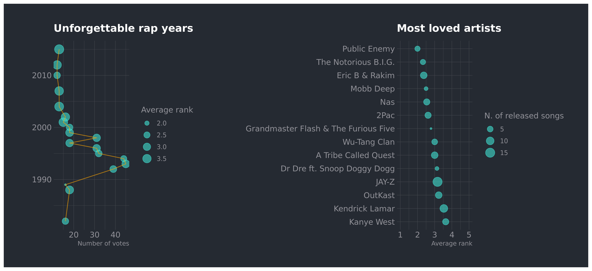
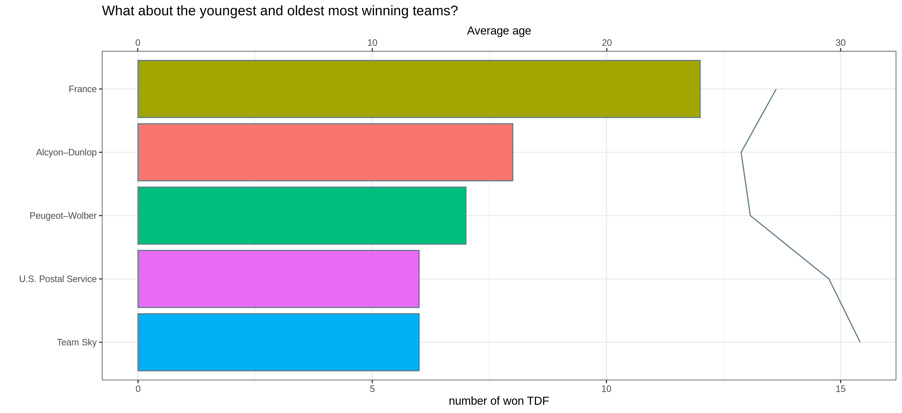

<!-- README.md is generated from README.Rmd. Please edit that file -->

# Tidytuesday `r emo::ji("smile")`
## My weekly commits for the tidytuesday project (https://github.com/rfordatascience/tidytuesday/)  

I've discovered this challenge during another challenge :) the #100DaysOfCode challenge. i've started during March 2020 quarantine for covid19. Hope one day will look back at these days and find a reason to smile and be happy about what i've accomplished. The list starts from the last one in time.

### Year 2020 Episode 19: Animal Crossing - New Horizons
For this episode i've explored quite a lot trying to find something interesting until i came up with this plot.. Still have to figure out why the months are in italian.. and why i couldnt' set the x_limits properly...

### Year 2020 Episode 18: Broadway
For this episode i was quite thrilled to explore the dataset and learn new things about Broadway. Havent been so far in NY but its on the todolist. 
*plot1*: I was curious to investigate instead the trend in the number of seats sold. Boringly, i've seen is quite stable for the shows that had the most number of seats sold. The average price is not corrected for inflation, will learn it in the next episode.
*plot2*: Here I plotted some the top 10 long-lived shows in Broadway and their contribution to the main Broadway theatre income. I have to admit that the output is a bit boring as, apart from the legendary "The phanthom of the opera" and "The Lion King" , i didn't learn much of new data. I was interested in exploring the revenue trend of each show. Ill not repeat it.

### Year 2020 Episode 17: GDPR Fines
It was not easy this one. I asked several questions. What was the distribution of the fine amounts. I had to use a logscale for this. After this, i was curious about what type of violations people/companies have been doing and i dig a bit into the type of violations and the related articles. I wish i could be a bit better with text manipulation but frankly speaking it's only my 30th day of coding, i can't pretend that much from myself. So i've used a cool function "cut" to divide the fine distribution into segment to see if any specific range was related to a specific type of violation or article violated. It was not, apparently. So i kind of give up and i came back on the most obvious plot: showing the violations by country (total amount of fines received and number of violations) 

### Year 2020 Episode 16: BBC - Survey - HipHop - followup
I was not satisfied with my plots. For several reasons:  
- There are two plots and not one  
- I'm kind of tired to show in the same plot a lot of information. What do you want to accomplish? This is not a scientific paper. That's direct communication  
- I didn't like the time on the y-axis, it makes it kind of weird  
So im showing here the main (obvious?) message extracted from the data.  
__important__: I've read the code of i think about the ~80% of the #tidytuesday plots i've seen. That was so instructive.

### Year 2020 Episode 16: BBC - Survey - HipHop
This was a cool one. All of us love music right? I enjoyed digging into this dataset from BBC where a bunch of critics were asked what was their HipHop top 5 personal rank of all time. After a week of r4ds studying, youtube screencasts, i've actually learned what are the basic steps to *easily* handle and explore a dataset. As DR says: "Always start exploring the categorical variables with some counting". After that it comes naturally to focus on some of them, summarize, and search for relationships between each other. Here, it was clear that the most voted songs belong to the 90s and the level has been decreasing since then. That's embarassing but i've no idea about who Public Enemy is!! 

### Year 2020 Episode 15: Tour de France
I don't know shit about Tour De France. Very very bad, i agree. In fact, one of my first questions to address was actually discover why i'm so uninterested in this sport. Too boring? too low profile? Does it depend on the geographical area where i was born? In the end i've just (badly) plotted the age of the most winning teams.. Interesting? Well, it still demonstrates that 30+ doesnt mean you're done.

