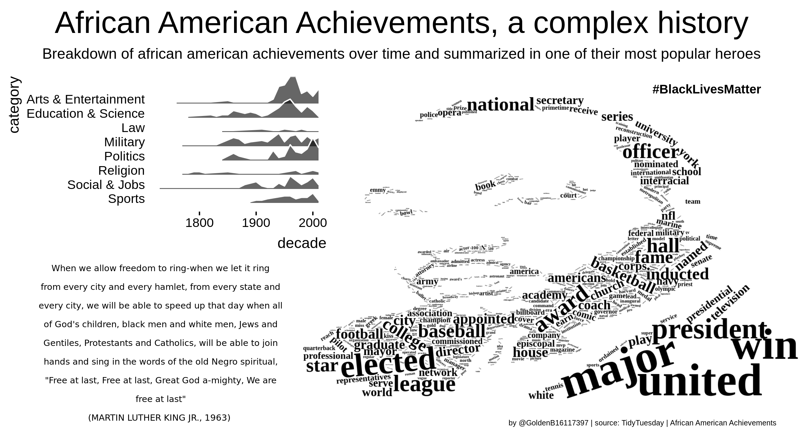
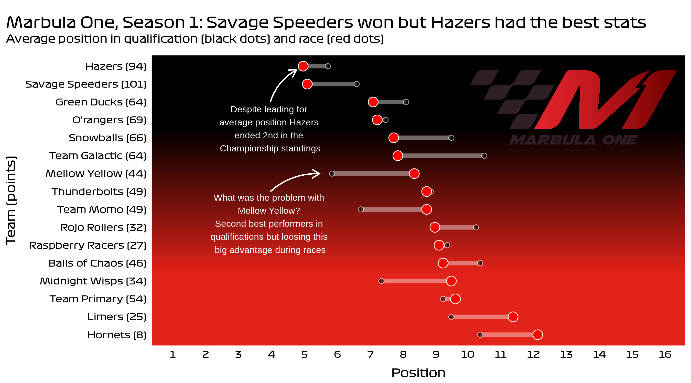
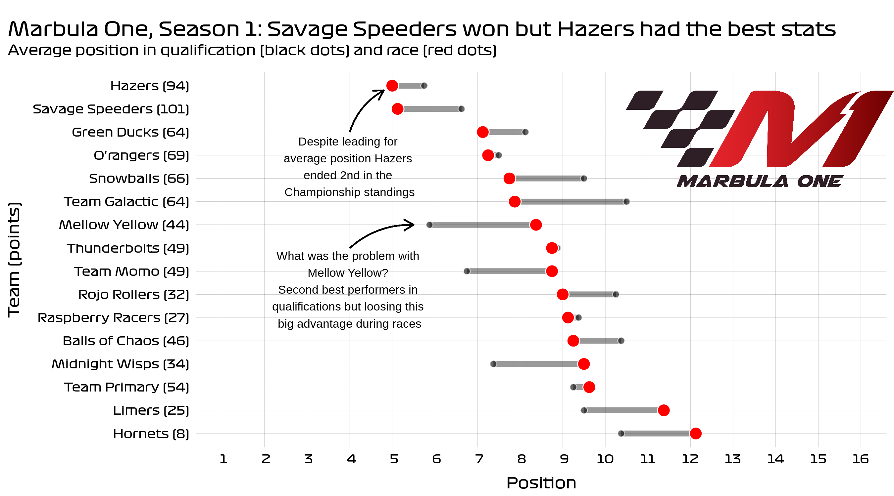
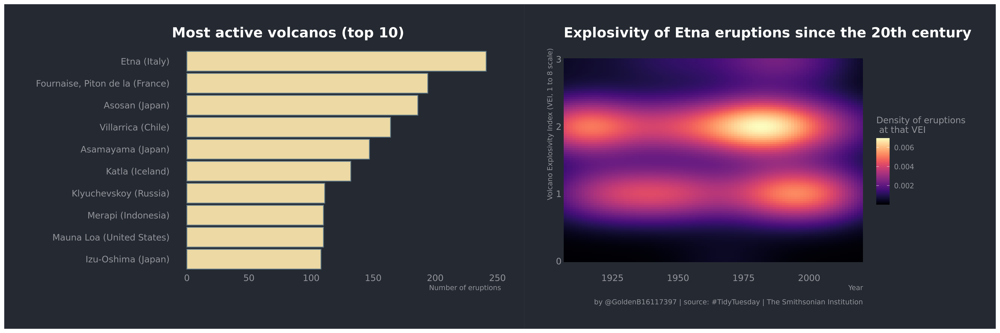

<!-- README.md is generated from README.Rmd. Please edit that file -->
Tidytuesday 😄
=============

My weekly commits for the tidytuesday project (<a href="https://github.com/rfordatascience/tidytuesday/" class="uri">https://github.com/rfordatascience/tidytuesday/</a>)
-------------------------------------------------------------------------------------------------------------------------------------------------------------------------

I’ve discovered this challenge during another challenge :) the
\#100DaysOfCode challenge. i’ve started during March 2020 quarantine for
covid19. Hope one day will look back at these days and find a reason to
smile and be happy about what i’ve accomplished. The list starts from
the last one in time.

### Year 2020 Episode 24: African American Achievements

Not much datascience this time. I learned using wordcloud2 and other
functions of cowplot.

### Year 2020 Episode 23: Marble Races

Thi is absolutely crazy kind of competition. There was not much
information in the dataset but i’ve enjoyed.  
\* learned how to add a rastergrob to my plot in ggplot. WOW!

### Year 2020 Episode 22: Cocktails

For this episode i’ve been happy to check the chapter for of textmining
book from D. Robinson and J. Silge. I’ve used pairwise correlation to
analyze correlation among drinks sharing my favourite ingredient:
orange. Citing from the book “We may instead want to examine correlation
among words, which indicates how often they appear together relative to
how often they appear separately. In particular, here we’ll focus on the
phi coefficient, a common measure for binary correlation. The focus of
the phi coefficient is how much more likely it is that either both word
X and Y appear, or neither do, than that one appears without the other.”
In my plot, words are drinks and the section in the text he’s referring
to is the ingredient.  
What i’ve learned:  
\* tidying with str\_detect() and str\_replace()  
\* pairwise correlation with the widyr package \* discovered
ggpomological which i’ve used for the color scale of the points/nodes in
the network  
\* struggled to set a nice font. Will check it in the next episode

### Year 2020 Episode 21: Beach volleyball

For this tidytuesday i really enjoyed learning the basics of ggraph. I
was curious of how many players changed their partners during their
career and their winning rate. What i’ve learned in this episode:  
\* how to tidy a wide format table with pivot\_longer(), separate(), and
spread().  
\* how to prepare data and plot a network with ggraph()

### Year 2020 Episode 20: Volcano Eruptions

For this episode i really wanted to learn a new thing. Of course I ended
up with a *magma* option from the viridis package in a density plot type
raster. Looks nice and not so many efforts. Etna is the most active
volcano in the world and i’ve been there.. It looks like a parallel
universe. What i’ve learned: \* how to prepare a raster density plot

### Year 2020 Episode 19: Animal Crossing - New Horizons

For this episode i’ve explored quite a lot trying to find something
interesting until i came up with this plot… Still have to figure out why
the months are in italian.. and why i couldnt’ set the x\_limits
properly….

### Year 2020 Episode 18: Broadway

For this episode i was quite thrilled to explore the dataset and learn
new things about Broadway. Havent been so far in NY but its on the
todolist. *plot1*: I was curious to investigate instead the trend in the
number of seats sold. Boringly, i’ve seen is quite stable for the shows
that had the most number of seats sold. The average price is not
corrected for inflation, will learn it in the next episode. *plot2*:
Here I plotted some the top 10 long-lived shows in Broadway and their
contribution to the main Broadway theatre income. I have to admit that
the output is a bit boring as, apart from the legendary “The phanthom of
the opera” and “The Lion King” , i didn’t learn much of new data. I was
interested in exploring the revenue trend of each show. Ill not repeat
it.

### Year 2020 Episode 17: GDPR Fines

It was not easy this one. I asked several questions. What was the
distribution of the fine amounts. I had to use a logscale for this.
After this, i was curious about what type of violations people/companies
have been doing and i dig a bit into the type of violations and the
related articles. I wish i could be a bit better with text manipulation
but frankly speaking it’s only my 30th day of coding, i can’t pretend
that much from myself. So i’ve used a cool function “cut” to divide the
fine distribution into segment to see if any specific range was related
to a specific type of violation or article violated. It was not,
apparently. So i kind of give up and i came back on the most obvious
plot: showing the violations by country (total amount of fines received
and number of violations)

### Year 2020 Episode 16: BBC - Survey - HipHop - followup

I was not satisfied with my plots. For several reasons:  
- There are two plots and not one  
- I’m kind of tired to show in the same plot a lot of information. What
do you want to accomplish? This is not a scientific paper. That’s direct
communication  
- I didn’t like the time on the y-axis, it makes it kind of weird  
So im showing here the main (obvious?) message extracted from the
data.  
**important**: I’ve read the code of i think about the ~80% of the
\#tidytuesday plots i’ve seen. That was so instructive.

### Year 2020 Episode 16: BBC - Survey - HipHop

This was a cool one. All of us love music right? I enjoyed digging into
this dataset from BBC where a bunch of critics were asked what was their
HipHop top 5 personal rank of all time. After a week of r4ds studying,
youtube screencasts, i’ve actually learned what are the basic steps to
*easily* handle and explore a dataset. As DR says: “Always start
exploring the categorical variables with some counting”. After that it
comes naturally to focus on some of them, summarize, and search for
relationships between each other. Here, it was clear that the most voted
songs belong to the 90s and the level has been decreasing since then.
That’s embarassing but i’ve no idea about who Public Enemy is!!

### Year 2020 Episode 15: Tour de France

I don’t know shit about Tour De France. Very very bad, i agree. In fact,
one of my first questions to address was actually discover why i’m so
uninterested in this sport. Too boring? too low profile? Does it depend
on the geographical area where i was born? In the end i’ve just (badly)
plotted the age of the most winning teams.. Interesting? Well, it still
demonstrates that 30+ doesnt mean you’re done.

